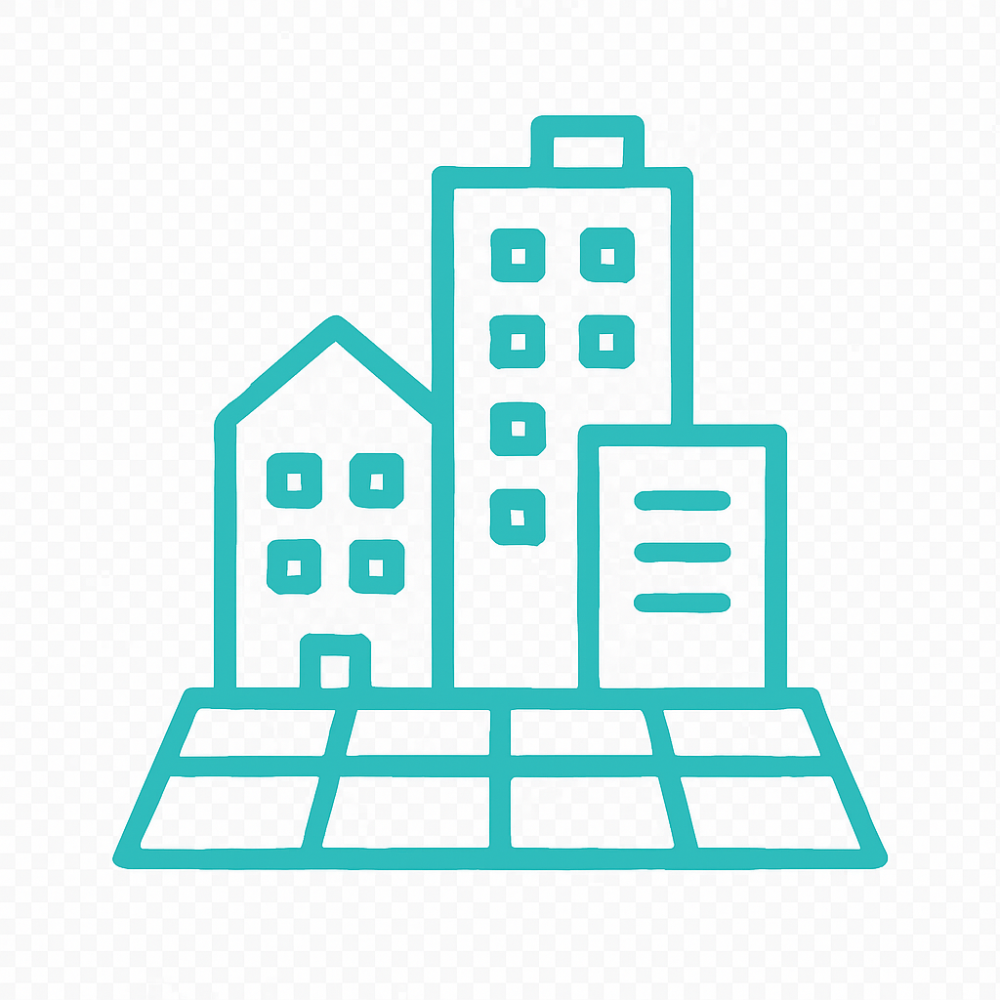

# Dokumentasi Templat Portofolio Urban Planning, Architecture & Mapping

## Daftar Isi
1. [Pengenalan](#pengenalan)
2. [Fitur Utama](#fitur-utama)
3. [Struktur File](#struktur-file)
4. [Panduan Instalasi](#panduan-instalasi)
5. [Panduan Customization](#panduan-customization)
6. [Panduan Deployment](#panduan-deployment)
7. [Troubleshooting](#troubleshooting)
8. [Support & Maintenance](#support--maintenance)

## Pengenalan

Templat portofolio ini dirancang khusus untuk profesional di bidang Urban Planning, Architecture, dan Mapping. Template ini menggabungkan desain modern, responsif, dan fungsionalitas yang komprehensif untuk menampilkan karya dan layanan secara profesional.

### Target Pengguna
- Urban Planner
- Arsitek
- GIS Specialist
- Konsultan Perencanaan Kota
- Freelancer di bidang terkait

### Teknologi yang Digunakan
- **HTML5**: Semantic markup untuk struktur yang solid
- **CSS3**: Modern styling dengan Grid, Flexbox, dan Custom Properties
- **Vanilla JavaScript**: Interaktivitas tanpa dependencies
- **Responsive Design**: Mobile-first approach
- **Modern Web Standards**: Accessibility dan Performance optimized

## Fitur Utama

### 🎨 Desain Visual
- **Color Scheme Profesional**: Deep Blue, Teal, dan Warm Gray
- **Typography System**: Inter untuk headers, Source Sans Pro untuk body text
- **High-Quality Assets**: AI-generated images dan custom icons
- **Consistent Branding**: Visual identity yang kohesif

### 📱 Responsive Design
- **Mobile-First**: Optimized untuk semua ukuran device
- **Breakpoints**: 320px (mobile), 768px (tablet), 1024px+ (desktop)
- **Touch-Friendly**: Button sizes dan spacing yang optimal
- **Cross-Browser**: Compatible dengan semua modern browsers

### ⚡ Performance
- **Fast Loading**: Optimized images dan efficient code
- **Smooth Animations**: Hardware-accelerated transitions
- **SEO Ready**: Semantic HTML dan meta tags
- **Accessibility**: WCAG 2.1 AA compliance ready

### 🔧 Functionality
- **Fixed Navigation**: Backdrop blur dengan smooth scrolling
- **Project Showcase**: Grid layout dengan hover effects
- **Contact Form**: Validation dan notification system
- **Interactive Elements**: Micro-interactions dan animations

## Struktur File

```
portfolio_template/
├── index.html                 # Main HTML file
├── assets/
│   ├── css/
│   │   └── style.css         # Main stylesheet
│   ├── js/
│   │   └── script.js         # Main JavaScript file
│   ├── images/               # Image assets
│   │   ├── hero_background.jpg
│   │   ├── profile_placeholder.jpg
│   │   ├── urban_planning_1.jpg
│   │   ├── urban_planning_2.jpg
│   │   ├── urban_planning_3.jpg
│   │   ├── architecture_1.jpg
│   │   ├── architecture_2.webp
│   │   ├── architecture_3.jpg
│   │   ├── mapping_1.png
│   │   ├── mapping_2.png
│   │   └── mapping_3.jpg
│   └── icons/                # Custom icons
│       ├── urban_planning_icon.png
│       ├── architecture_icon.png
│       └── mapping_icon.png
└── documentation/            # Documentation files
    ├── design_concept.md
    ├── wireframe_structure.md
    └── testing_results.md
```

## Panduan Instalasi

### Persyaratan Sistem
- Web browser modern (Chrome, Firefox, Safari, Edge)
- Text editor (VS Code, Sublime Text, atau sejenisnya)
- Web server lokal (optional untuk development)

### Langkah Instalasi

1. **Download Template**
   ```bash
   # Download atau clone template
   git clone [repository-url]
   cd portfolio_template
   ```

2. **Buka di Browser**
   ```bash
   # Buka file index.html di browser
   open index.html
   # atau
   python -m http.server 8000  # untuk local server
   ```

3. **Verifikasi Installation**
   - Pastikan semua images loading dengan benar
   - Test navigation dan scroll behavior
   - Verify responsive design di berbagai ukuran screen

## Panduan Customization

### 1. Informasi Personal

**Edit file `index.html`:**

```html
<!-- Ganti nama dan tagline -->
<h1 class="hero-title">
    <span class="hero-name">Nama Anda</span>
    <span class="hero-subtitle">Urban Planner • Architect • Mapper</span>
</h1>

<!-- Update deskripsi -->
<p class="hero-description">
    Deskripsi singkat tentang expertise dan pengalaman Anda.
</p>

<!-- Update informasi kontak -->
<div class="contact-item">
    <strong>Email:</strong>
    <span>email@anda.com</span>
</div>
```

### 2. Color Scheme

**Edit file `assets/css/style.css`:**

```css
/* Ganti color scheme di bagian atas file */
:root {
    --primary-color: #1B365D;    /* Deep Blue */
    --accent-color: #2DD4BF;     /* Teal */
    --background-color: #F5F5F5; /* Warm Gray */
    --text-color: #333;          /* Dark Gray */
}
```

### 3. Images dan Assets

**Ganti gambar dengan assets Anda:**

1. **Hero Background**: Replace `assets/images/hero_background.jpg`
2. **Profile Photo**: Replace `assets/images/profile_placeholder.jpg`
3. **Project Images**: Replace files di folder `assets/images/`
4. **Icons**: Customize icons di folder `assets/icons/`

**Recommended Image Sizes:**
- Hero Background: 1920x1080px (landscape)
- Profile Photo: 400x400px (square)
- Project Images: 800x600px (4:3 ratio)
- Icons: 256x256px (square, PNG dengan transparent background)

### 4. Content Sections

**About Section:**
```html
<!-- Edit di section about-preview -->
<p class="about-description">
    Ganti dengan bio profesional Anda yang menjelaskan 
    pengalaman, expertise, dan pendekatan kerja.
</p>

<ul class="expertise-list">
    <li>
        
        <span>Expertise Area 1</span>
    </li>
    <!-- Tambah atau edit expertise areas -->
</ul>
```

**Projects Section:**
```html
<!-- Edit project cards -->
<div class="project-card" data-category="urban-planning">
    <div class="project-image">
        
        <div class="project-overlay">
            <div class="project-overlay-content">
                <h3 class="project-title">Nama Project Anda</h3>
                <p class="project-description">Deskripsi singkat project</p>
                <a href="#" class="btn btn-primary btn-sm">View Project</a>
            </div>
        </div>
    </div>
    <div class="project-info">
        <span class="project-category">Kategori</span>
        <h3 class="project-name">Nama Project</h3>
    </div>
</div>
```

**Services Section:**
```html
<!-- Edit service cards -->
<div class="service-card">
    <div class="service-icon">
        
    </div>
    <h3 class="service-title">Nama Layanan</h3>
    <p class="service-description">
        Deskripsi layanan yang Anda tawarkan.
    </p>
    <ul class="service-features">
        <li>Feature 1</li>
        <li>Feature 2</li>
        <li>Feature 3</li>
        <li>Feature 4</li>
    </ul>
</div>
```

### 5. Typography

**Ganti font families:**
```css
/* Di bagian head HTML, ganti Google Fonts link */
<link href="https://fonts.googleapis.com/css2?family=YourHeaderFont:wght@300;400;500;600;700&family=YourBodyFont:wght@300;400;600&display=swap" rel="stylesheet">

/* Di CSS, update font families */
body {
    font-family: 'YourBodyFont', sans-serif;
}

h1, h2, h3, h4, h5, h6 {
    font-family: 'YourHeaderFont', sans-serif;
}
```

### 6. Navigation

**Edit menu items:**
```html
<ul class="nav-menu" id="nav-menu">
    <li class="nav-item">
        <a href="#home" class="nav-link">Home</a>
    </li>
    <li class="nav-item">
        <a href="#about" class="nav-link">About</a>
    </li>
    <!-- Tambah atau edit menu items -->
</ul>
```

## Panduan Deployment

### 1. Static Hosting (Recommended)

**Netlify:**
1. Zip folder `portfolio_template`
2. Drag & drop ke netlify.com
3. Custom domain (optional)

**Vercel:**
1. Connect GitHub repository
2. Auto-deploy on push
3. Custom domain setup

**GitHub Pages:**
1. Push ke GitHub repository
2. Enable GitHub Pages di Settings
3. Select source branch

### 2. Traditional Web Hosting

**Upload via FTP:**
1. Compress semua files
2. Upload ke public_html folder
3. Extract di server
4. Test functionality

**cPanel/File Manager:**
1. Login ke hosting control panel
2. Upload zip file
3. Extract di public folder
4. Set permissions jika diperlukan

### 3. Performance Optimization untuk Production

**Image Optimization:**
```bash
# Compress images sebelum upload
# Gunakan tools seperti TinyPNG, ImageOptim, atau Squoosh
```

**CSS/JS Minification:**
```bash
# Minify CSS dan JavaScript untuk production
# Gunakan tools seperti UglifyJS, CSSNano, atau online minifiers
```

**CDN Setup:**
```html
<!-- Gunakan CDN untuk fonts dan libraries -->
<link rel="preconnect" href="https://fonts.googleapis.com">
<link rel="preconnect" href="https://fonts.gstatic.com" crossorigin>
```

### 4. SEO Optimization

**Meta Tags:**
```html
<head>
    <meta charset="UTF-8">
    <meta name="viewport" content="width=device-width, initial-scale=1.0">
    <title>Nama Anda - Urban Planner & Architect</title>
    <meta name="description" content="Professional urban planning, architecture, and mapping services by [Nama Anda]. Specialized in sustainable development and innovative design solutions.">
    <meta name="keywords" content="urban planning, architecture, mapping, GIS, sustainable development">
    <meta name="author" content="Nama Anda">
    
    <!-- Open Graph -->
    <meta property="og:title" content="Nama Anda - Urban Planner & Architect">
    <meta property="og:description" content="Professional portfolio showcasing urban planning, architecture, and mapping projects">
    <meta property="og:image" content="path/to/og-image.jpg">
    <meta property="og:url" content="https://yourwebsite.com">
    
    <!-- Twitter Card -->
    <meta name="twitter:card" content="summary_large_image">
    <meta name="twitter:title" content="Nama Anda - Urban Planner & Architect">
    <meta name="twitter:description" content="Professional portfolio showcasing urban planning, architecture, and mapping projects">
    <meta name="twitter:image" content="path/to/twitter-image.jpg">
</head>
```

**Structured Data:**
```html
<script type="application/ld+json">
{
  "@context": "https://schema.org",
  "@type": "Person",
  "name": "Nama Anda",
  "jobTitle": "Urban Planner & Architect",
  "url": "https://yourwebsite.com",
  "sameAs": [
    "https://linkedin.com/in/yourprofile",
    "https://behance.net/yourprofile"
  ]
}
</script>
```

## Troubleshooting

### Common Issues

**1. Images tidak loading:**
- Check file paths (case-sensitive)
- Verify file formats (JPG, PNG, WebP)
- Ensure proper file permissions

**2. CSS tidak apply:**
- Check CSS file path di HTML
- Verify CSS syntax errors
- Clear browser cache

**3. JavaScript tidak berfungsi:**
- Check browser console untuk errors
- Verify JavaScript file path
- Ensure DOM elements exist

**4. Mobile responsiveness issues:**
- Test di berbagai devices
- Check viewport meta tag
- Verify CSS media queries

**5. Performance issues:**
- Optimize image sizes
- Minify CSS/JS files
- Enable gzip compression
- Use CDN untuk assets

### Browser Compatibility

**Supported Browsers:**
- Chrome 60+
- Firefox 55+
- Safari 12+
- Edge 79+

**Fallbacks untuk older browsers:**
- CSS Grid fallback dengan Flexbox
- Custom Properties fallback dengan regular CSS
- Intersection Observer polyfill

### Debugging Tips

**Developer Tools:**
```javascript
// Check console untuk errors
console.log('Debug info');

// Test responsive design
// Use device toolbar di Chrome DevTools

// Performance analysis
// Use Lighthouse di Chrome DevTools
```

## Support & Maintenance

### Regular Updates

**Content Updates:**
- Update project portfolio secara berkala
- Refresh testimonials dan achievements
- Update contact information

**Technical Maintenance:**
- Monitor website performance
- Update dependencies jika ada
- Backup files secara berkala
- Test functionality setelah hosting updates

### Security Considerations

**Best Practices:**
- Keep hosting platform updated
- Use HTTPS untuk production
- Regular security scans
- Backup strategy

### Analytics Setup

**Google Analytics:**
```html
<!-- Add sebelum closing </head> tag -->
<script async src="https://www.googletagmanager.com/gtag/js?id=GA_TRACKING_ID"></script>
<script>
  window.dataLayer = window.dataLayer || [];
  function gtag(){dataLayer.push(arguments);}
  gtag('js', new Date());
  gtag('config', 'GA_TRACKING_ID');
</script>
```

### Contact & Support

Untuk pertanyaan teknis atau customization lebih lanjut:
- Documentation: Lihat file-file di folder `documentation/`
- Issues: Check troubleshooting section
- Updates: Monitor untuk template updates

---

**Template Version**: 1.0  
**Last Updated**: December 2024  
**Compatibility**: Modern Browsers, Mobile Responsive  
**License**: [Specify your license terms]

